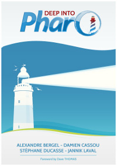
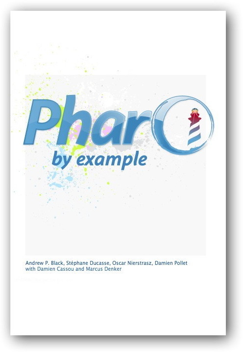

{
"title" : "Books",
"layout" : "index",
"publishDate" : "2025-06-01"
}

Over the years, I wrote the following books. I enjoyed it even if this is always more time-consuming than we would like. I also really have a lot of fun writing columns because this is a completely different exercise from scientific papers.

For the moment, I did not add the most recent books since you can find them at http://books.pharo.org/.

If you like my free books
- Buy them - Some are on https://www.amazon.com and https://www.decitre.fr
- Sponsor me :) (soon I will put back the paypal donate button)
- Send some money to the pharo association https://association.pharo.org

Thanks in advance. 

## Books

<table width="95%" height="174">
                <tr>
<td width="35%">
                        
</td>
<td width="65%">
[Object-Oriented Reengineering Patterns](https://www.oscar.nierstrasz.org/oorp/)
S. Demeyer, Stéphane Ducasse, and Oscar Nierstrasz, Morgan Kaufman Publishers, 2002.
This book presents reengineering patterns: recurring problems and solutions you encounter when
you reengineer large systems. It describes migration strategies, reverse engineering patterns, and reengineering patterns.                           
</td>
                </tr>

                <tr>
                    <td width="35%">
                        
                    </td>
                    <td width="65%">
                       
[Deep into Pharo](http://books.pharo.org)
Alexandre Bergel, Damien Cassou, Stéphane Ducasse, Jannik Laval, Square Bracket Associates, 2013.
                       
Deep into Pharo is the second volume of a series of books covering Pharo. Whereas the first volume is intended for newcomers, this second volume covers deeper topics. It is intended for both students and developers. This book is made available under the Creative Commons Attribution-ShareAlike 3.0 license. You can either download the 
[PDF](https://books.pharo.org) for free, or you can buy a softcover copy from [Lulu.com](http://www.lulu.com/shop/alexandre-bergel-and-damien-cassou-and-stephane-ducasse-and-jannik-laval/deep-into-pharo/paperback/product-21184147.html).
                    </td>
                </tr>

                <tr>
                    <td width="35%">
                        
                    </td>
                    <td width="65%">
                            [Pharo by Example](http://books.pharo.org)
                            Andrew P. Black, Stéphane Ducasse, Oscar Nierstrasz and Damien Pollet.Square Bracket Associates, 2009.

                         This book is intended for both students and developers. It will guide you gently through the language and environment by means of a series of examples and exercises. You can either download the [PDF](http://books.pharo.org) for free, or you can buy a softcover copy from [Lulu.com](http://www.lulu.com/shop/oscar-nierstrasz-and-stephane-ducasse-and-damien-pollet-and-andrew-p-black/pharo-by-example/paperback/product-11266407.html). 
                        	    
                    </td>
                </tr>

</table>

