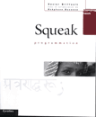

{
"title" : "Books",
"layout" : "index",
"publishDate" : "2025-06-01"
}

Over the years, I wrote the following books. I enjoyed it even if this is always more time-consuming than we would like. I also really have a lot of fun writing columns because this is a completely different exercise from scientific papers.

For the moment, I did not add the most recent books since you can find them at http://books.pharo.org/.

If you like my free books
- Buy them - Some are on https://www.amazon.com and https://www.decitre.fr
- Sponsor me :) (soon I will put back the paypal donate button)
- Send some money to the pharo association https://association.pharo.org

Thanks in advance. 

## Books

<table width="95%" height="174">

<tr>
<td width="35%">
                        
</td>
<td width="65%">
[Object-Oriented Reengineering Patterns](https://www.oscar.nierstrasz.org/oorp/)
S. Demeyer, Stéphane Ducasse, and Oscar Nierstrasz, Morgan Kaufman Publishers, 2002.
This book presents reengineering patterns: recurring problems and solutions you encounter when
you reengineer large systems. It describes migration strategies, reverse engineering patterns, and reengineering patterns.                           
</td>
</tr>

                <tr>
                    <td width="35%">
                        
                    </td>
                    <td width="65%">
                       
[Deep into Pharo](http://books.pharo.org)
Alexandre Bergel, Damien Cassou, Stéphane Ducasse, Jannik Laval, Square Bracket Associates, 2013.
                       
Deep into Pharo is the second volume of a series of books covering Pharo. Whereas the first volume is intended for newcomers, this second volume covers deeper topics. It is intended for both students and developers. This book is made available under the Creative Commons Attribution-ShareAlike 3.0 license. You can either download the 
[PDF](https://books.pharo.org) for free, or you can buy a softcover copy from [Lulu.com](http://www.lulu.com/shop/alexandre-bergel-and-damien-cassou-and-stephane-ducasse-and-jannik-laval/deep-into-pharo/paperback/product-21184147.html).
                    </td>
                </tr>

                <tr>
                    <td width="35%">
                        
                    </td>
                    <td width="65%">
                            [Pharo by Example](http://books.pharo.org)
                            Andrew P. Black, Stéphane Ducasse, Oscar Nierstrasz and Damien Pollet.Square Bracket Associates, 2009.

                         This is an old version. This book is intended for both students and developers. It will guide you gently through the language and environment by means of a series of examples and exercises. You can either download the [PDF](http://books.pharo.org) for free, or you can buy a softcover copy from [Lulu.com](http://www.lulu.com/shop/oscar-nierstrasz-and-stephane-ducasse-and-damien-pollet-and-andrew-p-black/pharo-by-example/paperback/product-11266407.html). 
                        	    
                    </td>
                </tr>

                <tr>
                    <td width="35%">
                        
                    </td>
                    <td width="65%">
                            [Squeak by example](https://hal.inria.fr/inria-00441576/document)
                             Andrew P. Black, St&eacute;phane Ducasse, Oscar Nierstrasz and Damien Pollet. Square Bracket Associates, 2007.

                         Watch out this book is old. Better read the recent version of [Pharo by example](https://books.pharo.org).
                        	    
                    </td>
                </tr>

                <tr>
                    <td width="35%">
                        
                    </td>
                    <td width="65%">
                            [Squeak: Learn programming with Robots](https://botsinclearners.github.io). Stéphane Ducasse. Apress Publishers, 2005.

This book teaches novices of all ages how to program. It is fun, interactive and deep. The book won the September Award of PCPlusMagazin. The first version is sold out after 4 months. A new version is under print. Check https://botsinclearners.github.io. Foreword by Alan Kay the Turing award 2004 (nobel prize in Computer Science). 
Here is the book at [Amazon](http://www.amazon.com/exec/obidos/search-handle-form/002-5536216-8746432) wish you a lot of fun with your kids... do not hesitate to share that with me. I'm thinking to produce a new version with the future version of Pharo new graphic stack.
                            
                    </td>
                </tr>

                <tr>
                    <td width="35%">
                        
                    </td>
                    <td width="65%">
                        Squeak (in French). X. Briffault and Stéphane Ducasse, Eyrolles, 2001. This book presents an old version of Squeak. It presents the multimedia, net, the language. It was one of the first book to present in French advanced tools such as refactoring and unit testing. Here are the final versions of some chapters.
             	 
- [Chapter 2](books/programminginsqueak/chap02.pdf)
- [Chapter 3](books/programminginsqueak/chap03.pdf)
- [Chapter 7](books/programminginsqueak/chap07.pdf)
- [Chapter 11](books/programminginsqueak/chap11.pdf)
                    </td>
                </tr>

                <tr>
                    <td width="35%">
                        
                    </td>
                    <td width="65%">
                            [ La programmation : une approche fonctionnelle et recursive avec Scheme ](https://stephaneducasse.github.io/books/recursiveprogramming/book.html)
                                 L. Arditi and S. Ducasse, Eyrolles, 1996.
                           
                            This book explains how recursion works, how to build recursive functions in a way that you are sure that they work. This book was used in the first and second years at the University of Nice-Sophia  Antipolis, where we had a lot of fun teaching.
                        

                    </td>
                </tr>

</table>

## Columns

