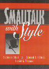
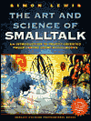

{
"title" : "Stef's Free Books",
"layout" : "index",
"publishDate" : "2025-06-01"
}

Some years ago, I started to be fed up to see all the books I like to be out of print, so I started to contact authors and collected their old books. I would like to thanks them all and their publishers as well. If you
know an author that is willing to give to the community a book, please give him my email. 

You can also support me. 

<form action="https://www.paypal.com/cgi-bin/webscr" method="post">
<input type="hidden" name="cmd" value="_s-xclick">
<input type="hidden" name="encrypted" value="-----BEGIN PKCS7-----MIIHRwYJKoZIhvcNAQcEoIIHODCCBzQCAQExggEwMIIBLAIBADCBlDCBjjELMAkGA1UEBhMCVVMxCzAJBgNVBAgTAkNBMRYwFAYDVQQHEw1Nb3VudGFpbiBWaWV3MRQwEgYDVQQKEwtQYXlQYWwgSW5jLjETMBEGA1UECxQKbGl2ZV9jZXJ0czERMA8GA1UEAxQIbGl2ZV9hcGkxHDAaBgkqhkiG9w0BCQEWDXJlQHBheXBhbC5jb20CAQAwDQYJKoZIhvcNAQEBBQAEgYA5UkdWiftJUd9RAv/H1tb6jkJPyRxw0wEqhOdBl92hUVjGCDAFCNDXLR2DlSDFBeschDqZzrHHOI3eyZ/J8l/LC078hfwg+nAea0UCuAgSrpBTVIYaQZBZIkJtrogYoDezVQkrDsscPoWDFA/E2L1+gdzIYmMTGxJPfg/E1Tk9STELMAkGBSsOAwIaBQAwgcQGCSqGSIb3DQEHATAUBggqhkiG9w0DBwQIYUH/CEm+e9yAgaAxXByOTTiK9lC9/LiDvOyaJwNMpBCnoBkyxEQ+AK//gtezXj7vXGmeZ9n8BW6EQQwSuICAvW0pqBWUc+fscG7cOJ9bkSqeRb8wGv5upUBZ83lQXRXsIjl6u0ASXNcINf+pmjo8NBfPKfsLDVeXCQglrTQluPd5YaPMpbm6ByBwAlGIICJs+d5RCKohbTQbyvKAKxlXHRIBx88kEHWl0DcZoIIDhzCCA4MwggLsoAMCAQICAQAwDQYJKoZIhvcNAQEFBQAwgY4xCzAJBgNVBAYTAlVTMQswCQYDVQQIEwJDQTEWMBQGA1UEBxMNTW91bnRhaW4gVmlldzEUMBIGA1UEChMLUGF5UGFsIEluYy4xEzARBgNVBAsUCmxpdmVfY2VydHMxETAPBgNVBAMUCGxpdmVfYXBpMRwwGgYJKoZIhvcNAQkBFg1yZUBwYXlwYWwuY29tMB4XDTA0MDIxMzEwMTMxNVoXDTM1MDIxMzEwMTMxNVowgY4xCzAJBgNVBAYTAlVTMQswCQYDVQQIEwJDQTEWMBQGA1UEBxMNTW91bnRhaW4gVmlldzEUMBIGA1UEChMLUGF5UGFsIEluYy4xEzARBgNVBAsUCmxpdmVfY2VydHMxETAPBgNVBAMUCGxpdmVfYXBpMRwwGgYJKoZIhvcNAQkBFg1yZUBwYXlwYWwuY29tMIGfMA0GCSqGSIb3DQEBAQUAA4GNADCBiQKBgQDBR07d/ETMS1ycjtkpkvjXZe9k+6CieLuLsPumsJ7QC1odNz3sJiCbs2wC0nLE0uLGaEtXynIgRqIddYCHx88pb5HTXv4SZeuv0Rqq4+axW9PLAAATU8w04qqjaSXgbGLP3NmohqM6bV9kZZwZLR/klDaQGo1u9uDb9lr4Yn+rBQIDAQABo4HuMIHrMB0GA1UdDgQWBBSWn3y7xm8XvVk/UtcKG+wQ1mSUazCBuwYDVR0jBIGzMIGwgBSWn3y7xm8XvVk/UtcKG+wQ1mSUa6GBlKSBkTCBjjELMAkGA1UEBhMCVVMxCzAJBgNVBAgTAkNBMRYwFAYDVQQHEw1Nb3VudGFpbiBWaWV3MRQwEgYDVQQKEwtQYXlQYWwgSW5jLjETMBEGA1UECxQKbGl2ZV9jZXJ0czERMA8GA1UEAxQIbGl2ZV9hcGkxHDAaBgkqhkiG9w0BCQEWDXJlQHBheXBhbC5jb22CAQAwDAYDVR0TBAUwAwEB/zANBgkqhkiG9w0BAQUFAAOBgQCBXzpWmoBa5e9fo6ujionW1hUhPkOBakTr3YCDjbYfvJEiv/2P+IobhOGJr85+XHhN0v4gUkEDI8r2/rNk1m0GA8HKddvTjyGw/XqXa+LSTlDYkqI8OwR8GEYj4efEtcRpRYBxV8KxAW93YDWzFGvruKnnLbDAF6VR5w/cCMn5hzGCAZowggGWAgEBMIGUMIGOMQswCQYDVQQGEwJVUzELMAkGA1UECBMCQ0ExFjAUBgNVBAcTDU1vdW50YWluIFZpZXcxFDASBgNVBAoTC1BheVBhbCBJbmMuMRMwEQYDVQQLFApsaXZlX2NlcnRzMREwDwYDVQQDFAhsaXZlX2FwaTEcMBoGCSqGSIb3DQEJARYNcmVAcGF5cGFsLmNvbQIBADAJBgUrDgMCGgUAoF0wGAYJKoZIhvcNAQkDMQsGCSqGSIb3DQEHATAcBgkqhkiG9w0BCQUxDxcNMDkwNTI1MjAxOTA4WjAjBgkqhkiG9w0BCQQxFgQU8lOc+4B3YBphy9VmcIF2SNo8kPQwDQYJKoZIhvcNAQEBBQAEgYANMnKY4SyFHz2Yr4H3+CTOeclFxKFjUQp7GR9gNgdlSQJA5NHDbcil5hDRE2rbmWSyMkwYciXnMA+6JxCnwXEAfyveGbXQ7QJJiRHg4RiNSp+oxyGacVMUqtigVTSWxijbRG99NWStwJokU3APEJZ+8XeHw8A5VSP8flvmzuuz1g==-----END PKCS7-----
">
<input type="image" src="https://www.paypal.com/en_US/i/btn/btn_donate_SM.gif" border="0" name="submit" alt="Donate to S. Ducasse via PayPal">

</form>

## Recent Pharo books

You can find a lot more recent and free books (Spec, Pharo by Example Updated, Pharo with Style, Learning OOD with TDD, and many more) at http://books.pharo.org. 

Most the new books around Pharo are hosted at http://github.com/SquareBracketAssociates and each project has an automatic build with the latest PDF version.

## Some other books

If you have more books and you want to get them archived and listed here please contact me.

<table>

<tr>
<td width="35%">

</td>
<td width="65%">
[ Dynamic Web Development with Seaside ](https://github.com/SquareBracketAssociates/DynamicWebDevelopmentWithSeaside/blob/master/originalPDF/2014-07-16-seaside.pdf)
By Stéphane Ducasse, Lukas Renggli, David C. Shaffer and Rick Zaccone. Square Bracket Associates, 2009.

This book is made available under the Creative Commons Attribution-ShareAlike 3.0 license. You can buy a softcover copy from [Lulu](http://www.lulu.com). Check https://github.com/SquareBracketAssociates/DynamicWebDevelopmentWithSeaside/
</td>
</tr>

<tr>
<td width="35%">

</td>
<td width="65%">

[ Pharo by Example (original version and translation) ](http://books.pharo.org/)
By Andrew P. Black, St&eacute;phane Ducasse, Oscar Nierstrasz, Damien Pollet with Damien Cassou and Marcus Denker. Square Bracket Associates, 2009.

Pay attention there is also Pharo by Example Updated (for Pharo 90).	 
This book is made available under the Creative Commons Attribution-ShareAlike 3.0 license. You will be able to  buy a softcover copy from [Lulu](https://www.lulu.com/).

</td>
</tr>

<tr>
<td width="35%">

</td>
<td width="65%">

[ Computer Programming using GNU Smalltalk ](freebooks/Gnu/computer_programming_using_gnu_smalltalk.pdf)
By Canol Gokel, free e-book. 2009. 
 
[Home page of the original version](https://www.canol.info/books/computer_programming_using_gnu_smalltalk)

</td>
</tr>

<tr>
<td width="35%">

</td>
<td width="65%">

[ Squeak by Example ](https://hal.inria.fr/inria-00441576/document)
By  Andrew P. Black, St&eacute;phane Ducasse, Oscar Nierstrasz and Damien Pollet. Square Bracket Associates, 2007.
Watch out this book is old. Better use Pharo and read [ Pharo by Example books](https://books.pharo.org).
</td>
</tr>

<tr>
<td width="35%">

</td>
<td width="65%">

[ Smalltalk design pattern companion book drafts ](freebooks/SmalltalkDesignPatternCompanion)
By Sherman Alpert, Kyle Brown, and Bobby Woolf. Addison-Wesley,  978-02011846241998.

The chapters listed here are not in their final form but more in draft form. Buy the book it is really excellent. 
</td>
</tr>

<tr>
<td width="45%">

</td>
<td width="55%">

[ Smalltalk by Example: the Developer's Guide ](freebooks/ByExample/SmalltalkByExampleNewRelease.pdf)  
By Alex Sharp, McGraw Hill Text; ISBN:  0079130364, 1997.

This book covers all kinds of issues basic level, design, testing... I  liked it a lot. The code and the book as a single file containing everything, are available. Thank again
Lukas Renggli for his effort for converting everything from Word. Thanks a lot Alec and McGraw-Hill.

</td>
</tr>

<tr>
<td width="35%">

</td>
<td width="65%">

[ Smalltalk With Style ](freebooks/WithStyle/SmalltalkWithStyle.pdf) by Edward Klimas, Suzanne Skublics, and David A. Thomas. 
ISBN: 0-13-165549-3, Publisher: Prentice Hall, Copyright: 1996. A great and small book that everybody should read. Thanks Ed, Suzanne and Dave to give it for free. 
</td>
</tr>

<tr>
<td width="35%">

</td>
<td width="65%">

[ Inside Smalltalk (Volume One) ](freebooks/InsideST/InsideSmalltalk.pdf)
By LaLonde, Wilf R. and Pugh, John R., Prentice-Hall, 1990, ISBN 0-13-468414-1.

</td>
</tr>

<tr>
<td width="35%">

</td>
<td width="65%">

[ Inside Smalltalk (Volume Two)](freebooks/InsideST/InsideSmalltalkII.pdf)
By LaLonde, Wilf R. and Pugh, John R., Prentice-Hall, 1990, ISBN 0-13-468414-1.

</td>
</tr>

<tr>
<td width="35%">

</td>
<td width="65%">

[ A Little Smalltalk ](freebooks/LittleSmalltalk/ALittleSmalltalk.pdf) 
By Tim Budd, Addison-Wesley 1987.  

Many thanks to Tim Budd and his publisher.

</td>
</tr>

<tr>
<td width="35%">

</td>
<td width="65%">

[ The Art and Science of Smalltalk ](freebooks/Art/artAdded174186187Final.pdf) 
By Simon Lewis, Prentice-Hall 1995-1999.  

Many thanks to the original publishers of this book at Prentice-Hall, the responsible of the HP series, and Simon Lewis.
</td>
</tr>

<tr>
<td width="35%">

</td>
<td width="65%">

[ Practical Smalltalk: Using Smalltalk/V ](freebooks/PracticalSmalltalk/PracticalSmalltalk.pdf) by Dan Shafer and By Dean A. Ritz, Springer Verlag; (July 1991).  

Many thanks to the original publishers of this book Springer Verlag,  and Dan. Thanks.
</td>
</tr>

<tr>
<td width="35%">

</td>
<td width="65%">

[ Smalltalk An Introduction to Application Development using VisualWorks ](freebooks/HopkinsHoran/HopkinsHoran.pdf)
By Trevor Hopkins and Bernard Horan,  Pearson Education, 1995.

Many thanks to the original publishers of this book,  Pearson Education, for permission to distribute this work, and of course the authors! 

</td>
</tr>

<tr>
<td width="45%">

</td>
<td width="55%">

[ Smalltalk and Object Orientation: an Introduction ](freebooks/STandOO/Smalltalk-and-OO.pdf)
Springer-Verlag, ISBN 3-540-76115-2, 1997.

This book provides a good survey of Smalltalk. Information is now obsolete
 but it is still worth reading. Enjoy it. Thanks John to support our request. We want to thank Springer Verlag Publishing for allowing us to give you this book for free.

</td>
</tr>

<tr>
<td width="35%">

</td>
<td width="65%">

[ Smalltalk V Tutorial ](freebooks/SmalltalkVTutorial/SmalltalkVTutorial.pdf)

</td>
</tr>

<tr>
<td width="45%">

</td>
<td width="55%">

[ The Taste of Smalltalk ](freebooks/Taste/) Ted Kaehler and Dave Patterson, W W Norton Co.; ISBN: 0393955052; (May 1986).

This book is for collectors. The quotes are really excellent. 
Enjoy it. (Scanned ... by Stef, Alex, Gabriela, and Lukas).
Thanks Ted.

</td>
</tr>

<tr>
<td width="45%">

</td>
<td width="55%">

[The Joy Of Smalltalk](freebooks/Joy/)
By Ivan Tomek (September 2000). 700 pages

Ivan wrote this book and he gave it to the community. It contains a lot of useful material. 
Thanks again Ivan and continue to write good books. 

</td>
</tr>

<tr>
<td width="45%">

</td>
<td width="55%">

[ Smalltalk-80, Bits of History, Words of Advice ](freebooks/BitsOfHistory/BitsOfHistory.pdf)
By Glen Krasner, Editor. ISBN 0-201-11669-3. 344 pp. 1983

This book is for collectors. Thanks Glenn.
</td>
</tr>

<tr>
<td width="45%">

</td>
<td width="55%">
[ Smalltalk-80: The Language and its Implementation ](freebooks/BlueBook/Bluebook.pdf)
By Adele Goldberg and DavidRobson; Xerox Palo Alto Research Center ISBN 0-201-11371-6. 344 pp. 1983
</td>
</tr>

<tr>
<td width="45%">

</td>

<td width="55%">
[ Smalltalk-80, The Interactive Programming Environment](freebooks/TheInteractiveProgrammingEnv/TheInteractiveProgrammingEnv.pdf)
By Adele Goldberg. ISBN  0201113724. 560 pp. 1983

This book is for collectors. Thanks Adele.
</td>
</tr>

<tr>
<td width="45%">

</td>
<td width="55%">
[ DRAFTS of Squeak, Open Personal Computing and Multimedia ](freebooks/CollectiveNBlueBook/)
Edited by Mark Guzdial and Kim Rose. Prentice-Hall 2000. 
 
</td>
</tr>

<tr>
<td width="45%">

</td>
<td width="55%">
[ DRAFS of Squeak: Open Personal Computing for Multimedia ](freebooks/GuzdialBookDrafts/)
By Mark Guzdial, Prentice-Hall, 2000. It's available from Prentice-Hall. 
</td>
</tr>

<tr>
<td width="45%">

</td>
<td width="55%">
[VisualAge Handbook V1](freebooks/VisualAge/VisualAgeHandbookV1.pdf)

</td>
</tr>

<tr>
<td width="45%">

</td>
<td width="55%">
[ Smalltalk-80 by Mevel and Gueguen ](freebooks/ST80/Smalltalk-80-MevelGueguen-MacmillanComputerScienceSeries-1987.pdf)
</td>
</tr>

<tr>
<td width="45%">

</td>
<td width="55%">
[ Smalltalk, Objects, and Design ](freebooks/SmalltalkObjectsAndDesign/SmalltalkObjectsAndDesign--ChamondLiu--9780132683357.pdf)

</td>
</tr>

<tr>
<td width="45%">

</td>
<td width="55%">
[ Object Oriented Engineering ](freebooks/ObjectOrientedEngineering/Object-OrientedEngineering-Building EngineeringSystems--JohnRBourne--9780256112108.pdf)
</td>
</tr>

<tr>
<td width="45%">

</td>
<td width="55%">
[ The 4404 Tektronic manual ](freebooks/Tektronic/4404_Introduction_to_the_Smalltalk-80_System_Aug85.pdf)

</td>
</tr>

<tr>
<td width="45%">

</td>
<td width="55%">
[Decouvrir la programmation à objets avec Smalltalk-V](freebooks/Decouvrir/Decouvrir-Masson.pdf)
</td>
</tr>

<tr>
<td width="35%">

</td>
<td width="65%">

[ (In German) Syntaxbasierte Programmierwerkzeuge ](freebooks/Syntax/Syntax.zip)
By L. Schmitz, B.G. Teubner Stuttgart 1995.

This book presents compilation techniques in german.

</td>
</tr>

<tr>
<td width="35%">

</td>
<td width="65%">

[ (In German) Smalltalk
Einfuehrung in die objekt-orientierte Programmierung ](freebooks/SmalltalkDE/smalltalkBuch.pdf)
By Peter P. Bothner, Wolf-Michael Kaehler 1999. This book presents object-oriented programming in german with VisualWorks.  

</td>
</tr>

<tr>
<td width="45%">

</td>
<td width="55%">

[  (In Swedish) Objektorienterad programmering i Smalltalk ](freebooks/Swedish/)
By Bjoern Eiderbaeck, Per Haegglund, and Olle Baelter
Thanks Bjoern Eiderbaeck.
</td>
</tr>

<tr>
<td width="45%">

</td>
<td width="55%">

[ (In Spanish) Programando con Smalltalk](freebooks/Programando/ProgramandoConSmalltalk-BORRADORFINAL07-Febrero-2006.pdf)
by Diego Gomez Deck.

Thanks Diego. This book is distributed under the Creative Commons license.

</td>
</tr>
</table>

## Old Articles

I added some articles because they illustrate the philosophy behind Smalltalk.

- [The article from the Conference History of Programming Languages](http://freebooks/SmalltalkHistoryHOPL.pdf)
- [ Design principles behind Smalltalk ](https://freebooks/BlueBookHughes/DesignPrinciples BehindSmalltalk.pdf)
- [ Byte magazine archive ](https://archive.org/details/byte-magazine-1981-08)
